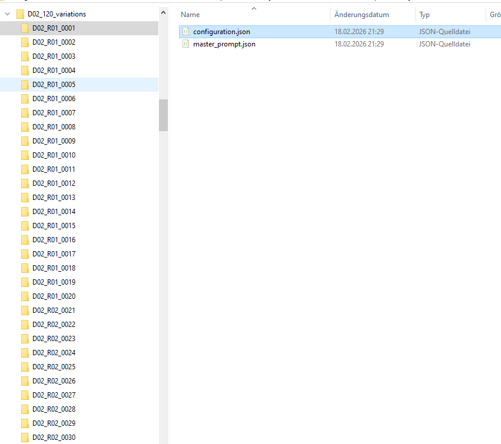
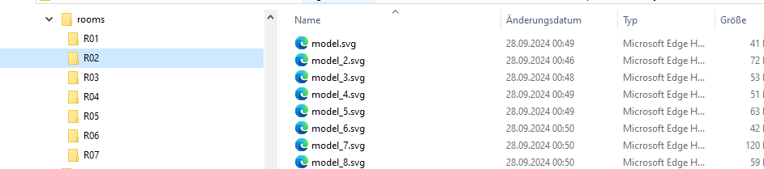
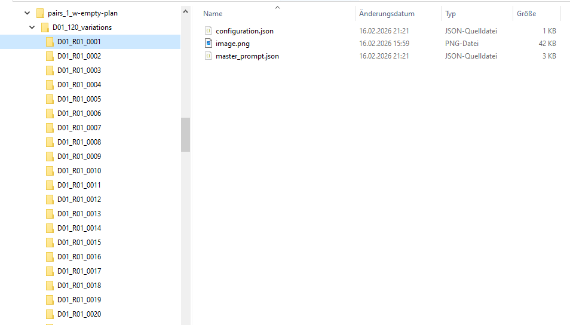
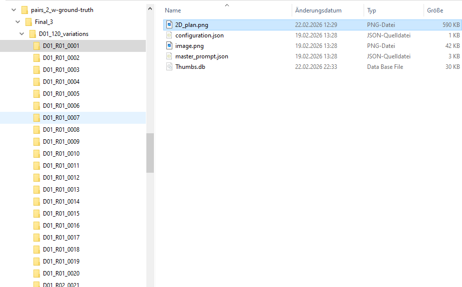
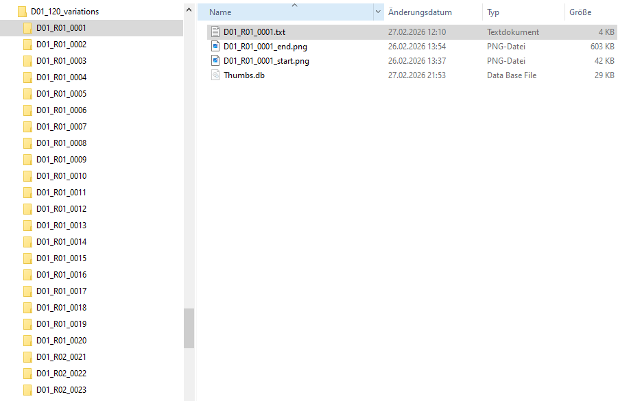
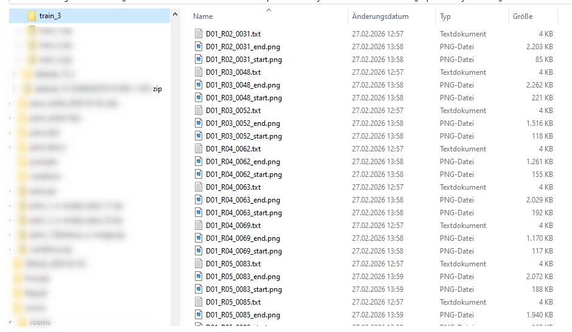

# Dataset Generation for Empty Plan Generation

## 1. Step: Generate  Dataset pairs with no image 

### 1.1 Structure of dataset pairs:
- The pairs are generated by using LLM (e.g. GPT-5.2) to create prompts for different variations:
    - Variations in design style: "DXX", there are defined 25 different design styles
        - 1. Bohemian (Boho)
        - 2. Modern Farmhouse
        - 3. Traditional
        - 4. French Country
        - 5. Hollywood Glam
        - 6. Coastal
        - 7. Art Deco
        - 8. Southwestern
        - 9. Japandi
        - 10. Rustic
        - 11. Shabby Chic
        - 12. Eclectic
        - 13. Contemporary
        - 14. Asian Zen
        - 15. Mediterranean
        - 16. Maximalist
        - 17. Bauhaus
        - 18. Tropical
        - 19. Industrial
        - 20. Mid-century
        - 21. Scandinavian
        - 22. Victorian
        - 23. Retro
        - 24. Urban
        - 25. High-tech
    - Variations in room-count: RYY
        - R01: 1 room flat
        - R02: 2 room flat
        - R03: 3 room flat
        - R04: 4 room flat
        - R05: 5 room flat
        - R06: 6 room flat
    - Variations in color, hobbies, ...: ZZZZ

- Each dataset pair is generated into a folder with this naming convention: DXX_RYY_ZZZZ, where XX is the design style, YY is the room count, and ZZZZ is the variation, see example:

### 1.2 Structure of dataset pair prompts:
- The generated prompts are then used to generate images using a diffusion model (e.g. FLUX.1)
    - Master prompt: is identical for all dataset pairs:
       '''
       {
  "task": "Add furniture to the provided empty floorplan image. Keep the EXACT same layout. Output ONE 2D top-down floor plan image.",
  "input_image_role": "empty_floorplan_to_furnish",
  "num_outputs": 1,
  "CRITICAL_RULES": [
    "DO NOT change the floor plan layout or room positions",
    "DO NOT add any new text labels - only keep labels that exist in the input image",
    "DO NOT add descriptive text like furniture names or descriptions",
    "KEEP the exact same walls, doors, windows, and room shapes",
    "ONLY add furniture inside existing rooms"
  ],
  "global_constraints": {
    "do_not_change_architecture": true,
    "keep_walls_doors_windows_fixed": true,
    "keep_room_count_exact": "{{rooms_count}}",
    "do_not_add_or_remove_rooms": true,
    "do_not_add_new_text_labels": true,
    "keep_scale_realistic": true,
    "no_furniture_overlap": true
  },
  "design_brief": {
    "household": "{{household}}",
    "persona_lifestyle": "{{persona_lifestyle}}",
    "hobby_tags": "{{hobby_tags_json_array}}",
    "personality_social": "{{personality_social}}",
    "routine": "{{routine}}",
    "needs_must_implement": "{{needs_json_array}}",
    "desires_implement_if_feasible": "{{desires_json_array}}",
    "budget_level": "{{budget}}",
    "storage_intensity": "{{storage_intensity}}",
    "cabinet_target_guide": "{{cabinet_target_guide}}"
  },
  "style_pack": {
    "style_id": "{{style_id}}",
    "interior_style": "{{interior_style}}",
    "palette_description": "{{palette}}",
    "materials_description": "{{materials}}"
  },
  "output": {
    "name": "2D_topview_plan",
    "camera": "strictly_top_down_orthographic",
    "render_mode": "flat_2D_architectural_diagram",
    "STRICT_VIEW_RULES": [
      "EVERYTHING must be shown from DIRECTLY ABOVE - bird's eye view only",
      "ALL furniture shown as simple geometric shapes seen from above",
      "Tables = rectangles or circles from above",
      "Chairs = small squares or circles from above",
      "Sofas = rectangles from above",
      "Beds = rectangles from above",
      "Plants = small circles (pot rim from above) - NO leaves visible",
      "Shelves/bookcases = rectangles from above - NO books visible from front",
      "NO object should show any front view or side view"
    ],
    "style_requirements": [
      "Clean architectural floor plan style",
      "Flat colors, no shadows, no 3D effects",
      "Simple filled shapes for furniture",
      "Keep only the original room labels from input image",
      "Do NOT add any new text or labels"
    ]
  },
  "negative_prompt": "front view, side view, 3D objects, visible book spines, leafy plants, plant leaves, furniture labels, text descriptions, furniture names, new labels, extra text, changing layout, adding rooms, moving walls, grid, collage, multiple views, shadows, perspective, isometric"
}
       '''

    - Configuration Prompt: is specific for each dataset pair
    '''
    {
  "variation_id": "D02_R01_0001",
  "style_id": 2,
  "interior_style": "Modern Farmhouse",
  "rooms_count": 1,
  "household": "multi-generational",
  "persona_lifestyle": "DIY enthusiast",
  "hobby_tags_json_array": [
    "fitness",
    "travel",
    "hosting"
  ],
  "personality_social": "balanced",
  "routine": "reading nights",
  "needs_json_array": [
    "extra storage",
    "pet friendly"
  ],
  "desires_json_array": [
    "bright",
    "calm"
  ],
  "budget": "low",
  "storage_intensity": "high",
  "cabinet_target_guide": {
    "kitchen_cabinet_areas": 3,
    "bath_vanities": 1,
    "closet_count": 1
  },
  "palette": "creamy white with sage green accents and light wood",
  "materials": [
    "matte black metal fixtures and hardware",
    "wrought iron details and rustic ceramics",
    "linen/cotton textiles in neutral tones"
  ]
}

# 1.3 LLM prompt to generate the dataset pair prompts along with the folder structure

'''
For an AI generation project we need pairs of a) empty floor plans b) fully finished interior design floor plans (with furnitures, decoration, floor color,...) As a basis we have already a big dataset of empty floorplans, but now we need to generate diverse pairs for the finished floor plans. These shall also be generated by using Generative AI, but we need the respective prompts for the different interior design variations.
The design variations depend basically on 
9different parameters which are defined below with 
Possible values, but not complete
With possible examples how these values impact the final interior design
To generate a high number of dataset pairs with a statistical relevant distribution we need 
These parameters formally defined
A value set for each parameter which is as much as possible exhaustive
Many different combinations of these parameters
A very detailed prompt for the generative AI which serves as input to generate the respective finished interior design based on an empty floorplan and the detailed description in the prompt
Please provide all these necessary descriptions. For d) we need 50 different combinations for which 10 apply to the same empty floorplan (number of rooms constant), and each with 5 different variations/combinations of the other parameters based on a) and b) 
1. Number of rooms available (according to empty floorplan)
Values: 1, 2, 3, 4, 5, 6, 7, 8
2. Parameter: Lifestyle, Profession, Hobbies
Values: Professional race pilot, runs every day 10km, collects small race cars,…
Examples: 
formula-1 racer, soccer player, engineer, designer, enterpreneur, farmer,…
How it influences the design: This parameter influences the potential home-office area
If someone loves cooking then a bigger kitchen, e.g. with kitchen island
If there is a pet in the house, then a space for the pet

3. Parameter: Desires
Values: Cinema (for watching races), cooking (big modern kitchen), …
Examples:
If someone wants to have a home cinema, a pool, a bar,
If someone wants to host many people,
If someone plays poker, then a poker table

4. Parameter: Needs
Values: Workout space (wants to be always fit), makes meditation
Examples:
If there are 3 kids going the school, then each need their own desk
If there is a permanent nanny for a kid, then a separate room for the nanny is needed
5. Parameter: Routine
Values: Sleeps until 10am, running everyday, goes out with dog, workout
Examples:
Usually sleeps until 10am, afterwards goes running everyday, then goes out with the dog, then does workout
Works everyday late in the night

6. Parameter: Personality
Values: Introvert, not many friends, no girlfriend,
Examples:
If someone is introvert and has not many friends, then a smaller dining table, but a bigger sofa
If someone is extrovert with many friends and many guests, then a bigger dining table and a guest room

7. Parameter: How many people live or use the space
Examples:
2 adults
2 adults, 1 kid
2 adults, 2 kids
2 adults, 2 kids, 1 dog
Number of people impacts the number of bedrooms and the number of beds and number of desks (homework, homeoffice)
8. Parameter: Cost, Budget
With low budget, the technical list contains cheaper furnitures
9. Storage needs
Values: Number of cabinets
Examples:
With kids that has many hobbies (toys, ….) needs more cabinets and storage rooms
'''

'''
My image generator shall be nano banana, so it supports image-conditioning and it supports negative prompts and json mode, seed control.
But I think there should also given the room count which then should be constant for each of these 5 variations for the identical empty floor plan.
Please provide the master prompt and the parameter files.
'''

'''
I want 5 total per floorplan for 10 different floorplans, so 50 total
'''

'''
now adapt the master prompt in the way that
- it creates the batch of all 5 designs in one prompting step
- and additionally also create for each variation of the exact same design a semi-3D top view like in the attached example (only take the 3d view as relevant, not the style):
'''

'''
and please generate again also the configuration json files again, so that each variation is a separate file also containing the rooms count,...
'''

'''
please create a zip file for download
'''

'''
Now generate 3000 variations, 500 with 1 room, 500 with 2 rooms, 500 with 3 rooms, 500 with 4 rooms, 500 with 5 rooms, 500 with 6 rooms.
Generate for each variation one folder which contains the master-prompt and the specific configuration of the room. Then put these 3000 folders under one folder and zip this root folder for download.
'''

'''
from now on use these 25 design styles:

1 Bohemian (Boho)
2 Modern Farmhouse
3 Traditional
4 French Country
5 Hollywood Glam
6 Coastal
7 Art Deco
8 Southwestern
9 Japandi
10 Rustic
11 Shabby Chic
12 Eclectic
13 Contemporary
14 Asian Zen
15 Mediterranean
16 Maximalist
17 Bauhaus
18 Tropical
19 Industrial
20 Mid-century
21 Scandinavian
22 Victorian
23Retro
24 Urban
25 High-tech
'''

'''
Now I want you to create the prompts for 120 variations for the same style, i.e. altogether 25 styles * 120 variations = 3000 variations. And for each of these 120 variations of the same style, there shall be each 20 with the same room-count, i.e. 20 with room-count = 1, 20 with room-count=2,... until 20 with room-count = 6, so that it makes again 120 with 6 different room-counts, and 20 for each room-count.
And the prompt-variations shall be located in folders with this naming: D01_R01_0001, D01_R01_0002, ... D01_R01_0020, D01_R02_0021, D01_R02_0022, ... D01_R02_0040, D01_R02_0041,... D01_R02_0060, ... D01_R06_0100, ... D01_R01_0120.
Please create for now only for the first Design-Style D01 = Bohemian (Boho) and provide a zip-file for all the folders.
'''

'''
Now I want you to create the prompts for 120 variations for the same style, i.e. altogether 25 styles * 120 variations = 3000 variations. And for each of these 120 variations of the same style, there shall be each 20 with the same room-count, i.e. 20 with room-count = 1, 20 with room-count=2,... until 20 with room-count = 6, so that it makes again 120 with 6 different room-counts, and 20 for each room-count.
And the prompt-variations shall be located in folders with this naming: D02_R01_0001, D02_R01_0002, ... D02_R01_0020, D02_R02_0021, D02_R02_0022, ... D02_R02_0040, D02_R02_0041,... D02_R02_0060, ... D02_R06_0100, ... D02_R01_0120.
Please use the attached json as master prompt.
Please create for now only for the first Design-Style D02 = Modern Farmhouse and provide a zip-file for all the folders.
'''

## 2. Step: Generate  Dataset pairs with empty floorplans
- use the public available floorplans on Kaggle_1/cubicasa5k/high_quality_architectural
- search in these images for plans with different number of rooms and sort them into this folder sturcture:

- then sort these empty floorplans into the corresponding room-count folders:

- these datasets (master_prompt.json, configuration.json, image.png (emtpy-floor-plan.png)) are now used to generate the synthetic datasets with groundtruth images (2D_plan.png), using nano banana:

## 3. Step: Conversion Step A
- merge master_prompt.json and configuration.json into one file
- convert the json into a txt-file

## 4. Step: Conversion Step B
- flattening: the training backend (fal.ai) requires a flat dataset structure (see: [fal-ai/flux-2-trainer/edit](https://fal.ai/models/fal-ai/flux-2-trainer/edit))
'''
XXX_start.png/jpg  → original image (unedited)
XXX_start2.png/jpg → optional extra reference (up to 4 total)
XXX_start3.png/jpg
XXX_start4.png/jpg
XXX_end.png/jpg    → desired edited result
XXX.txt            → optional instruction prompt
'''
- this leads to this final dataset folder structure:

